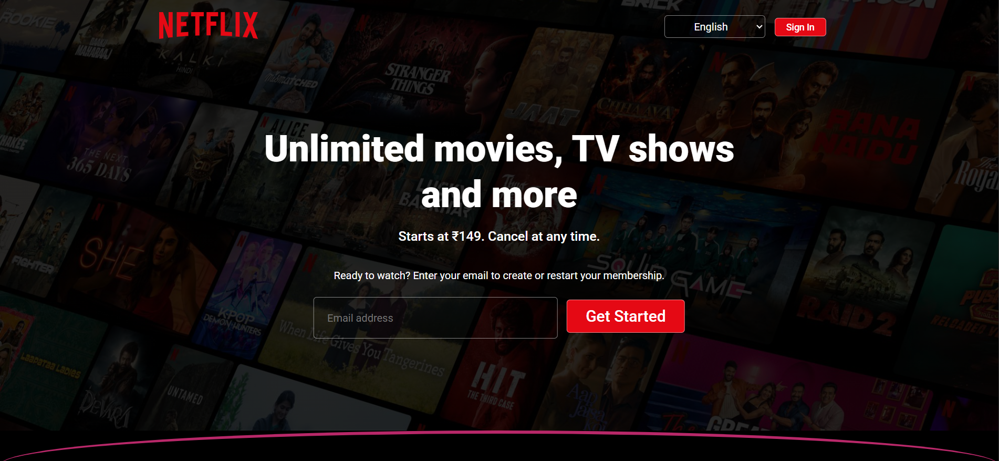
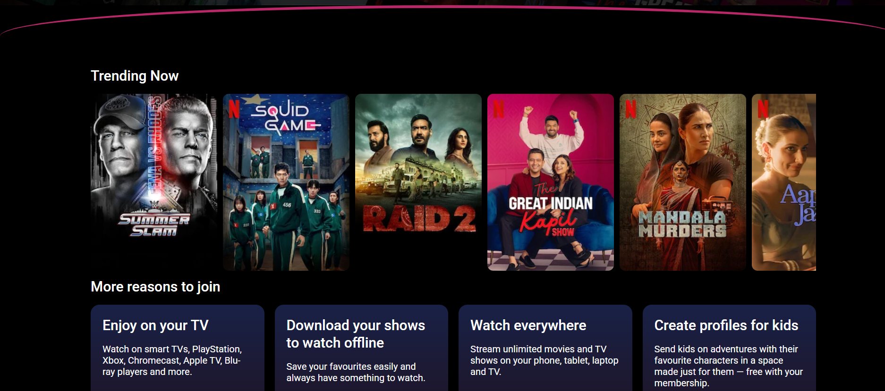
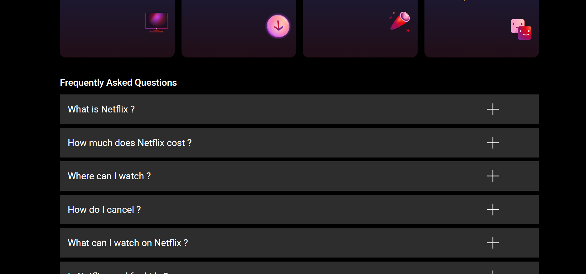
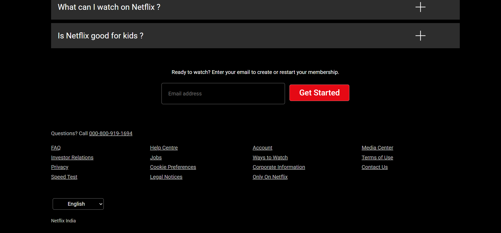

# 🎬 Netflix India Landing Page UI Clone

This is a **UI clone** of the Netflix India landing page that I built to practice my **HTML and CSS** skills. It replicates the look and feel of the original Netflix India page, focusing on layout, design structure, and visual styling.

> ⚠️ This is **not an exact clone**, as replicating every detail of Netflix’s dynamic site using only HTML and CSS is quite challenging.

---

## 🚀 Purpose of the Project

- Improve my frontend design skills using only HTML and CSS.
- Understand layout techniques like Flexbox and positioning.
- Learn how large-scale UIs are structured.
- Lay the foundation for future projects using advanced technologies like **JavaScript**, **React.js**, and eventually a **MERN stack** full-stack application.

---

## 📱 Current Limitations

- ❌ Not fully responsive yet (works best on desktop view).
- ❌ No interactivity or animations.
- ❌ No backend or dynamic content.

These limitations are intentional as the project’s focus was purely **static UI design**.

---

## 🛠️ Technologies Used

- **HTML5**
- **CSS3**

---

## 📅 What's Next?

- Make the page fully **responsive** using media queries and mobile-first design.
- Add **JavaScript** for interactivity (e.g., FAQ toggle, input validation).
- Rebuild this page using **React.js**.
- Extend the project into a **full-stack Netflix-inspired platform** using the **MERN Stack** (MongoDB, Express.js, React.js, Node.js).


---
---

## 🚀 Live Demo
[[Click here to try the app](https://our-deepak.github.io/Netflix-India-Landing-page-UI-clone/)] 

## 📸 Preview






---

## 📂 How to Use

Just open the `index.html` file in your browser:

```bash
git clone https://github.com/our-deepak/Netflix-India-Landing-page-UI-clone.git
cd netflix-india-ui-clone
open index.html
